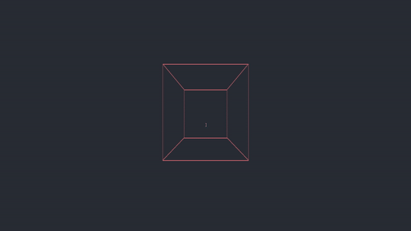

# Immerse

        

Rendering of 3D objects on a terminal screen using ASCII characters  
_(My attempt to learning how computer graphics works from ground up with 
the help the library ncurses and C++ language)_

### Instructions
_Clone the Project_  
`git clone https://github.com/azimex/Immerse.git`  
_Change directory and make_  
`cd Immerse; make`  
_Run_  
`make run`  

### Controls  
_Move Left/Down/Up/Right_  
`h/j/k/l`  
_Zoom IN/OUT_  
`i/o`  
_Quit_  
`q/Q`

Features To be Implemented:  
_Rotation_  
_Perspective Projection_

---
### Immerse is part of the [Concept](https://github.com/azimex/Concept) Series.
